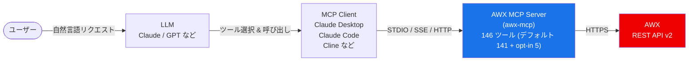

# AWX MCP Server

[English](README.md) | [🇰🇷 한국어](README.ko.md)


LLM が AWX インスタンスと連携できるようにする MCP（Model Context Protocol）サーバーです。

**146 個のツール**でインベントリ、ホスト、プロジェクト、ジョブテンプレート、ワークフロー、認証情報、実行環境、RBAC、システム管理など AWX のすべての主要機能をカバーします。

> デフォルトでは 141 個のツールが登録されます。残りは 2 つの opt-in フラグで有効化されます: `AWX_MCP_ENABLE_CREDENTIAL_MANAGEMENT=true` は、Form mode elicitation で機密データを収集する 4 個の認証情報/ユーザー書き込みツール（`create_credential`、`update_credential`、`create_user`、`update_user`）を追加します([Credential Management (opt-in)](#credential-management-opt-in) 参照)。`AWX_MCP_ENABLE_AD_HOC_COMMAND=true` は、複数ホストにまたがってコマンドを実行する `run_ad_hoc_command` を追加します([Ad Hoc Command Execution (opt-in)](#ad-hoc-command-execution-opt-in) 参照)。

---

## 目次

- [クイックスタート](#クイックスタート)
- [前提条件](#前提条件)
- [アーキテクチャ](#アーキテクチャ)
- [互換性](#互換性)
- [機能](#機能)
- [インストール](#インストール)
- [設定](#設定)
- [Credential Management (opt-in)](#credential-management-opt-in)
- [Ad Hoc Command Execution (opt-in)](#ad-hoc-command-execution-opt-in)
- [MCPクライアント連携](#mcpクライアント連携)
- [使用例](#使用例)
- [ツール一覧](#ツール一覧)
- [トラブルシューティング](#トラブルシューティング)
- [コントリビューション](#コントリビューション)
- [行動規範](#行動規範)
- [変更履歴](#変更履歴)
- [セキュリティポリシー](#セキュリティポリシー)
- [ライセンス](#ライセンス)

---

## クイックスタート

このサーバーはローカルクローンから [uv](https://docs.astral.sh/uv/) で実行します。リポジトリをクローンして依存関係を一度同期してください:

```bash
git clone https://github.com/lycorp-jp/awx-mcp
cd awx-mcp
uv sync          # .venv を作成して依存関係をインストール
```

次に、クローンパスを `uv run --directory <path>` で MCP クライアントに指定します。`/path/to/awx-mcp` はクローン先の絶対パスに置き換えてください。

### Claude Desktop（`claude_desktop_config.json`）

```json
{
  "mcpServers": {
    "awx": {
      "command": "uv",
      "args": ["run", "--directory", "/path/to/awx-mcp", "awx-mcp"],
      "env": {
        "ANSIBLE_BASE_URL": "https://awx.example.com/",
        "ANSIBLE_TOKEN": "your_api_token"
      }
    }
  }
}
```

### Claude Code（CLI）

```bash
claude mcp add awx \
  -e ANSIBLE_BASE_URL=https://awx.example.com/ \
  -e ANSIBLE_TOKEN=your_api_token \
  -- uv run --directory /path/to/awx-mcp awx-mcp
```

設定後、LLM に「AWX に登録されているインベントリの一覧を表示して」のように自然言語でリクエストできます。

---

## 前提条件

- アクセス可能な AWX インスタンスとそのベース URL（REST API v2）、および適切な権限を持つ API トークン（またはユーザー名 + パスワード）
- [uv](https://docs.astral.sh/uv/)

---

## アーキテクチャ



> LLM がユーザーのリクエストを解析して適切な MCP ツールを選択し、AWX MCP サーバーが AWX REST API を呼び出して結果を返します。

> このサーバーは **STDIO**（デフォルト）、**SSE**、**Streamable HTTP** トランスポートをサポートします。ローカルの MCP クライアントには STDIO を、リモート/共有デプロイには SSE または Streamable HTTP を使用してください。

---

## 互換性

| コンポーネント | サポート |
|--------------|---------|
| AWX | 24.6.1（REST API v2） |
| Python | ≥ 3.10 |
| MCP トランスポート | STDIO、SSE、Streamable HTTP |

---

## 機能

### AWX リソース管理

インベントリ、ホスト、グループ、ジョブテンプレート、ジョブ、プロジェクト、ワークフロー、認証情報、RBAC、組織/チーム/ユーザー、実行環境、スケジュール、システム管理など AWX の全主要機能をカバーします。[ツール一覧](#ツール一覧) を参照してください。

### 技術的特徴

- **モジュール構造**: 20 のドメインモジュールで関心事を分離し、可読性・保守性を向上
- **トークンキャッシュ**: username/password 認証時にトークンを再利用し、不要なトークン生成を防止
- **ページネーション制御**: `limit` パラメーターで各レスポンスを要求件数に切り詰めるため、大量の結果セットが LLM コンテキストを圧迫しません
- **デフォルトで安全（Safe by default）**: 機密データを扱う 4 つの認証情報/ユーザー書き込みツールと、`run_ad_hoc_command`（複数ホストにまたがるリモート実行）は、それぞれの opt-in フラグ（`AWX_MCP_ENABLE_CREDENTIAL_MANAGEMENT=true`、`AWX_MCP_ENABLE_AD_HOC_COMMAND=true`）が設定されない限り登録されません。デフォルトのデプロイは機密データを扱うツールや複数ホストにコマンドを実行するツールを公開しません — [Credential Management (opt-in)](#credential-management-opt-in) および [Ad Hoc Command Execution (opt-in)](#ad-hoc-command-execution-opt-in) 参照
- **ツールパラメーター露出の低減（opt-in 有効化時）**: 認証情報の入力とパスワードを [MCP Elicitation](https://modelcontextprotocol.io/specification/2025-11-25/client/elicitation)（Form mode）で収集し、ツールパラメーターとしては渡さないようにします
- **読み取り専用モード**: `AWX_MCP_READ_ONLY=true` を設定すると、起動時に読み取りツール（`list_*`/`get_*`）のみが公開されます

---

## インストール

このサーバーはパッケージインデックスに公開されていません。[uv](https://docs.astral.sh/uv/) を使用してローカルクローンから実行してください。

```bash
# 1. リポジトリをクローン
git clone https://github.com/lycorp-jp/awx-mcp
cd awx-mcp

# 2. 依存関係を同期（.venv を自動作成）
uv sync

# 3. 必須環境変数を設定
export ANSIBLE_BASE_URL="https://awx.example.com/"
export ANSIBLE_TOKEN="your_api_token"

# 4a. stdio で実行（デフォルト — ローカル MCP クライアント用）
uv run awx-mcp

# 4b. Streamable HTTP で実行（リモート/共有アクセス用）
uv run awx-mcp --transport streamable-http --host 127.0.0.1 --port 8000
#    エンドポイント: http://127.0.0.1:8000/mcp

# 4c. SSE で実行
uv run awx-mcp --transport sse --port 8000
#    エンドポイント: http://127.0.0.1:8000/sse
```

MCP クライアントを設定する際は、`--directory` でクローンパスを指定することで任意のディレクトリから実行できます:

```bash
uv run --directory /path/to/awx-mcp awx-mcp
```

**CLI フラグ** (`--transport`、`--host`、`--port`) は `AWX_MCP_TRANSPORT`、`AWX_MCP_HOST`、`AWX_MCP_PORT` 環境変数より優先されます。

> stdio の場合、通常は MCP クライアントがプロセスを自動的に起動します（[MCP クライアント連携](#mcpクライアント連携) 参照）。手動で実行する必要はありません。

---

## 設定

環境変数で AWX 接続情報を設定します。MCP クライアント設定の `env` ブロックに直接記述してください。

### 必須

| 変数 | 説明 | 例 |
|------|------|-----|
| `ANSIBLE_BASE_URL` | AWX インスタンス URL（末尾の `/` は任意） | `https://awx.example.com` |

### 認証（どちらか一方を選択）

**方法 1: API トークン（推奨）**

AWX UI であらかじめ生成したトークンを使います。トークンは期限切れにならないため、より安定した方法です。

| 変数 | 説明 |
|------|------|
| `ANSIBLE_TOKEN` | 事前生成済みの API トークン |

> AWX UI でのトークン生成: ユーザープロフィール > トークン > 追加 > Scope: Write

**方法 2: ユーザー名 + パスワード**

サーバーが自動的に OAuth2 トークンを生成してキャッシュします。

| 変数 | 説明 |
|------|------|
| `ANSIBLE_USERNAME` | AWX ユーザー名 |
| `ANSIBLE_PASSWORD` | AWX パスワード |

### オプション

| 変数 | デフォルト | 説明 |
|------|-----------|------|
| `ANSIBLE_SSL_VERIFY` | `true` | TLS 証明書検証（`true`/`false`）。検証は**デフォルトで有効**です。`false` にすると検証が無効になります（**非推奨（危険）** — 警告がログに出力されます。CA バンドルを持たない開発/自己署名環境でのみ使用してください）。 |
| `ANSIBLE_CA_BUNDLE` | 未設定 | 検証が有効な場合に信頼するカスタム CA バンドル/自己署名証明書（PEM）へのパス。検証を無効にせずに、プライベート CA を使用する AWX インスタンスへ接続できます。パスが存在しない場合、サーバーは起動時に即座に失敗します。 |
| `ANSIBLE_LOG_LEVEL` | `INFO` | ログレベル（`DEBUG`、`INFO`、`WARNING`、`ERROR`） |
| `AWX_MCP_ENABLE_CREDENTIAL_MANAGEMENT` | `false` | Form mode elicitation で機密データを収集する 4 つの認証情報/ユーザー書き込みツールを有効化するか。[Credential Management (opt-in)](#credential-management-opt-in) を参照。 |
| `AWX_MCP_ENABLE_AD_HOC_COMMAND` | `false` | `run_ad_hoc_command`（インベントリ内の一部またはすべてのホストに対して ad hoc Ansible コマンドを実行）を有効化するか。デフォルトでは無効化されており、有効化すると起動時に警告がログに出力されます。[Ad Hoc Command Execution (opt-in)](#ad-hoc-command-execution-opt-in) を参照。 |
| `AWX_MCP_READ_ONLY` | `false` | `true` にすると、起動時にすべての書き込み/破壊的ツールが登録解除され、読み取り専用ツール（`list_*`/`get_*`）のみ公開されます。安全な参照や監査専用の自動化に有用です。 |
| `AWX_MCP_TRANSPORT` | `stdio` | MCP トランスポート種別: `stdio`、`sse`、`streamable-http`。 |
| `AWX_MCP_HOST` | `127.0.0.1` | `sse` および `streamable-http` トランスポートのバインドホスト。 |
| `AWX_MCP_PORT` | `8000` | `sse` および `streamable-http` トランスポートのバインドポート。 |
| `AWX_MCP_TLS_ENABLE` | `false` | `true` にすると、`sse`/`streamable-http` サーバーがプロセス内で HTTPS を配信します（uvicorn）。`stdio` では無視されます（ネットワークソケットがないため、警告がログに出力されます）。 |
| `AWX_MCP_TLS_CERT` | 未設定 | サーバー TLS 証明書（PEM）へのパス。ネットワークトランスポートで `AWX_MCP_TLS_ENABLE=true` の場合に必須で、パスが存在しない/見つからない場合はサーバーが起動時に即座に失敗します。 |
| `AWX_MCP_TLS_KEY` | 未設定 | サーバー TLS 秘密鍵（PEM）へのパス。TLS が有効な場合に必須です。 |
| `AWX_MCP_TLS_KEY_PASSWORD` | 未設定 | 秘密鍵が暗号化されている場合のパスワード。任意。 |
| `AWX_MCP_USAGE_LOG_FILE` | 未設定 | JSON Lines 形式の利用ログファイルへのパス。MCP ツール呼び出しごとに 1 件の JSON ドキュメント（`@timestamp`、`user`、`tool`、`kind`、`trace_id`、`server_version`、`success`、`latency_ms`、`transport`、`awx_host`、失敗時の `error{type,message}`）が記録されます。未設定の場合はファイルが作成されず、計装自体が無効になります。[詳細利用ログ](#詳細利用ログ) を参照。 |
| `AWX_MCP_SERVER_LOG_FILE` | 未設定 | サーバー診断ログファイルへのパス。既存の stderr 診断・エラー出力をそのままファイルにも記録します。未設定の場合は stderr のみで、ファイルは作成されません。 |
| `AWX_MCP_SERVER_LOG_FORMAT` | `plain` | サーバー診断ログの形式: `plain` または `json`。 |
| `AWX_MCP_LOG_BACKUP_COUNT` | `7` | ローテーションしたログファイルの保持数。両方のログファイルは毎日 UTC 深夜 0 時に日付サフィックス付きでローテーションされます。 |

### TLS / 証明書検証

TLS 証明書検証は**デフォルトで有効**です（`ANSIBLE_SSL_VERIFY=true`）。AWX インスタンスがプライベート/内部 CA が発行した証明書（または自己署名証明書）を使用している場合は、`ANSIBLE_CA_BUNDLE` に CA バンドル（PEM）のパスを設定してください — 検証を有効にしたままそのCAを信頼できるようになり、検証を無効化するより推奨される方法です。

`ANSIBLE_SSL_VERIFY=false` を設定すると検証が完全に無効になります。この値が使用されるたびにサーバーが警告をログに出力するため、開発環境でのみ使用してください。スキームのない `ANSIBLE_BASE_URL` ホストは自動的に `https://` へ引き上げられます。明示的な `http://` URL はそのまま使用されますが、API トークンが暗号化されずに送信されるため、サーバーが警告をログに出力します。

### HTTPS で配信（インバウンド TLS）

これは**インバウンド** TLS です — MCP クライアントからこのサーバーへの接続を暗号化するもので、`ANSIBLE_SSL_VERIFY` が制御するアウトバウンドの AWX 証明書検証とは方向が異なります。両者を混同しないでください。

`sse` と `streamable-http` トランスポートにのみ適用されます。`stdio` はネットワークソケットを持たないローカルパイプであるため TLS は適用されず、セキュリティはプロセス/ホストの分離によって確保されます。

有効化するには、`AWX_MCP_TLS_ENABLE=true` とともに `AWX_MCP_TLS_CERT`、`AWX_MCP_TLS_KEY` を設定してください（鍵が暗号化されている場合は `AWX_MCP_TLS_KEY_PASSWORD` も設定）:

```bash
export AWX_MCP_TLS_ENABLE=true
export AWX_MCP_TLS_CERT=/path/to/server.crt
export AWX_MCP_TLS_KEY=/path/to/server.key
uv run awx-mcp --transport streamable-http --host 0.0.0.0 --port 8443
```

**重要:** HTTPS はトラフィックを暗号化するだけで、*誰が*接続しているかを認証するものではありません。このサーバーにはリクエスト単位のクライアント認証がなく、すべての AWX 呼び出しに単一の `ANSIBLE_TOKEN` を使用します。ネットワークに公開する HTTPS エンドポイントは、ネットワークポリシー、ファイアウォール、または認証機能を持つリバースプロキシで保護する必要があります。Kubernetes では ingress で TLS を終端するのが一般的な方法であり、プロセス内 TLS は Pod までのエンドツーエンド暗号化が必要な場合にのみ必要です。

### 詳細利用ログ

利用ログは opt-in 方式です。`AWX_MCP_USAGE_LOG_FILE` に書き込み可能なパスを設定すると、ツール呼び出しごとに 1 件の JSON ドキュメントを [JSON Lines](https://jsonlines.org/) 形式で記録し始めます。この形式は Filebeat や Fluentd などの外部ログ収集基盤が後で収集・集計しやすいように設計されています。ログが stdout に出力されることはありません — MCP stdio トランスポートはプロトコルメッセージの送受信に stdout を使用するため、ここにログを書き込むとプロトコルストリームが破損します。サーバー自体がログデータをネットワーク経由で送信することもなく、設定したローカルファイルにのみ書き込みます。

各エントリには `kind` フィールドも含まれます: 通常の MCP ツール呼び出しは `"tool"`、サーバーが起動時に一度だけ呼び出す `/api/v2/me/` ユーザー解決リクエストは `"internal_api"`（`tool: "GET /api/v2/me/"` として記録）です。これにより、統計上で実際のツール利用と内部オーバーヘッドを区別できます。

---

## Credential Management (opt-in)

4 つのツール — `create_credential`、`update_credential`、`create_user`、`update_user` — は **Form mode elicitation** でパスワードや認証情報入力などの機密データを収集します。これらはデフォルトでは**登録されない**ため、デフォルトの 141 ツール構成は機密データを扱うツールを一切公開しません。

有効化するには以下を設定してください:

```bash
AWX_MCP_ENABLE_CREDENTIAL_MANAGEMENT=true
```

Form mode elicitation は MCP 仕様の観点で機密データに対して非準拠の状態です。クライアント側のロギングやその他の中間システムによってレスポンスが露出する可能性があります。信頼できる隔離された環境でのみ使用してください。脅威モデルと開示ポリシーの詳細については [SECURITY.md](./SECURITY.md) を参照してください。

---

## Ad Hoc Command Execution (opt-in)

`run_ad_hoc_command` は、インベントリ内の一部またはすべてのホストに対して ad hoc Ansible コマンドを実行します — 実質的に複数ホストにまたがるリモートコマンド実行です。デフォルトでは**登録されません**。

有効化するには以下を設定してください:

```bash
AWX_MCP_ENABLE_AD_HOC_COMMAND=true
```

このフラグを有効にすると、サーバーは起動時に警告をログに出力します。運用者が ad hoc 実行を明確に必要としており、その影響範囲を許容できる場合にのみ有効化してください。脅威モデルの詳細については [SECURITY.md](./SECURITY.md) を参照してください。

---

## MCPクライアント連携

### Claude Desktop

`claude_desktop_config.json` に以下を追加します:

```json
{
  "mcpServers": {
    "awx": {
      "command": "uv",
      "args": ["run", "--directory", "/path/to/awx-mcp", "awx-mcp"],
      "env": {
        "ANSIBLE_BASE_URL": "https://awx.example.com/",
        "ANSIBLE_TOKEN": "your_api_token"
      }
    }
  }
}
```

### Claude Code（CLI）

```bash
claude mcp add awx \
  -e ANSIBLE_BASE_URL=https://awx.example.com/ \
  -e ANSIBLE_TOKEN=your_api_token \
  -- uv run --directory /path/to/awx-mcp awx-mcp
```

### Cline（VS Code）

MCP サーバー設定に以下を追加します:

```json
{
  "awx": {
    "command": "uv",
    "args": ["run", "--directory", "/path/to/awx-mcp", "awx-mcp"],
    "env": {
      "ANSIBLE_BASE_URL": "https://awx.example.com/",
      "ANSIBLE_TOKEN": "your_api_token"
    }
  }
}
```

### HTTP & SSE トランスポート

サーバーを `--transport streamable-http` または `--transport sse` で起動している場合、サブプロセスコマンドの代わりに HTTP エンドポイントを MCP クライアントに指定します。

**Streamable HTTP**（エンドポイント: `http://host:8000/mcp`）:

```json
{
  "mcpServers": {
    "awx": { "type": "streamable-http", "url": "http://127.0.0.1:8000/mcp" }
  }
}
```

**SSE**（エンドポイント: `http://host:8000/sse`）:

```json
{
  "mcpServers": {
    "awx": { "type": "sse", "url": "http://127.0.0.1:8000/sse" }
  }
}
```

> **セキュリティ（重要）:** HTTP/SSE トランスポートには**組み込み認証がありません**。サーバーはデフォルトで `127.0.0.1`（ループバック）にバインドされます。ループバック以外のアドレスにバインドするとサーバーが警告をログに出力します。ネットワークに公開する場合は**認証機能を持つ TLS リバースプロキシ**の背後に配置し、ファイアウォールでポートを制限してください。信頼できないネットワークに直接公開しないでください。

---

## 使用例

MCP クライアント（Claude など）に自然言語でリクエストすると、サーバーが適切なツールを呼び出します。

### インベントリ管理

```
「Production インベントリのホスト一覧を表示して」
→ list_hosts(inventory_id=1)

「web-server-01 を Production インベントリに追加して」
→ create_host(name="web-server-01", inventory_id=1)

「DB サーバーを database グループにまとめて」
→ create_group(...) + add_host_to_group(...)
```

### ジョブ実行とモニタリング

```
「Deploy App ジョブテンプレートを実行して」
→ launch_job(template_id=5)

「さっき実行したジョブの状態を確認して」
→ get_job(job_id=123)

「ジョブの実行ログを表示して」
→ get_job_stdout(job_id=123)

「失敗したジョブを再実行して」
→ relaunch_job(job_id=123)
```

### プロジェクト & SCM

```
「すべてのプロジェクトを最新の状態に同期して」
→ list_projects() + sync_project(project_id=...) を繰り返し実行

「my-project にあるプレイブック一覧を表示して」
→ list_project_playbooks(project_id=3)
```

### ワークフロー

```
「デプロイワークフローを実行して、承認が必要なら承認して」
→ launch_workflow(template_id=10)
→ list_workflow_approvals() → approve_workflow(approval_id=...)

「ワークフロー実行結果で失敗したノードを確認して」
→ list_workflow_job_nodes(workflow_job_id=50)
```

### RBAC & ユーザー管理

```
「developer チームに Production インベントリの読み取り権限を付与して」
→ list_object_roles(...) + grant_role_to_team(role_id=..., team_id=...)

「新しいユーザー john を作成して DevOps チームに追加して」
→ create_user(...) + grant_role_to_user(...)
```

### システム管理

```
「AWX のバージョンとクラスターの状態を確認して」
→ get_ansible_version() + list_instances()

「90 日以上前のジョブ記録を削除して」
→ list_system_job_templates() → launch_system_job(template_id=..., extra_vars='{"days": 90}')
```

---

## ツール一覧

合計 **146 個**のツールを 20 モジュールで提供します。デフォルトでは 141 個が登録され、以下の **opt-in** とマークされた 5 つはそれぞれのフラグが設定された場合のみ公開されます — 4 つは `AWX_MCP_ENABLE_CREDENTIAL_MANAGEMENT=true`([Credential Management (opt-in)](#credential-management-opt-in) 参照)、1 つは `AWX_MCP_ENABLE_AD_HOC_COMMAND=true`([Ad Hoc Command Execution (opt-in)](#ad-hoc-command-execution-opt-in) 参照)。

<details>
<summary><strong>146個すべてのツールを表示</strong></summary>

### インベントリ & インベントリソース管理（14）- `inventories.py`

| ツール | 説明 |
|--------|------|
| `list_inventories` | インベントリ一覧を取得 |
| `get_inventory` | 特定のインベントリの詳細を取得 |
| `create_inventory` | 新しいインベントリを作成 |
| `update_inventory` | インベントリを更新 |
| `delete_inventory` | インベントリを削除 |
| `list_inventory_sources` | インベントリソース一覧を取得 |
| `get_inventory_source` | 特定のインベントリソースの詳細を取得 |
| `create_inventory_source` | 新しいインベントリソースを作成 |
| `update_inventory_source` | インベントリソースを更新 |
| `sync_inventory_source` | インベントリソースを同期 |
| `delete_inventory_source` | インベントリソースを削除 |
| `list_inventory_updates` | インベントリ更新（同期）履歴を取得 |
| `get_inventory_update` | 特定のインベントリ更新の詳細を取得 |
| `cancel_inventory_update` | 実行中のインベントリ更新をキャンセル |

### ホスト管理（5）- `hosts.py`

| ツール | 説明 |
|--------|------|
| `list_hosts` | ホスト一覧（インベントリでフィルタ可能） |
| `get_host` | 特定のホストの詳細を取得 |
| `create_host` | 新しいホストを作成（変数含む） |
| `update_host` | ホストを更新 |
| `delete_host` | ホストを削除 |

### グループ管理（7）- `groups.py`

| ツール | 説明 |
|--------|------|
| `list_groups` | インベントリ内のグループ一覧 |
| `get_group` | 特定のグループの詳細を取得 |
| `create_group` | 新しいグループを作成（変数含む） |
| `update_group` | グループを更新 |
| `delete_group` | グループを削除 |
| `add_host_to_group` | ホストをグループに追加 |
| `remove_host_from_group` | グループからホストを削除 |

### ジョブテンプレート管理（13）- `job_templates.py`

| ツール | 説明 |
|--------|------|
| `list_job_templates` | ジョブテンプレート一覧 |
| `get_job_template` | 特定のジョブテンプレートの詳細を取得 |
| `create_job_template` | 新しいジョブテンプレートを作成 |
| `update_job_template` | ジョブテンプレートを更新 |
| `delete_job_template` | ジョブテンプレートを削除 |
| `launch_job` | ジョブテンプレートからジョブを実行 |
| `copy_job_template` | ジョブテンプレートをコピー |
| `get_job_template_survey` | ジョブテンプレートのサーベイを取得 |
| `set_job_template_survey` | ジョブテンプレートのサーベイを設定 |
| `delete_job_template_survey` | ジョブテンプレートのサーベイを削除 |
| `list_template_credentials` | テンプレートに関連付けられた認証情報一覧 |
| `associate_credential_with_template` | テンプレートに認証情報を関連付け |
| `disassociate_credential_from_template` | テンプレートから認証情報を解除 |

### ジョブ管理（7）- `jobs.py`

| ツール | 説明 |
|--------|------|
| `list_jobs` | ジョブ一覧（ステータスでフィルタ可能） |
| `get_job` | 特定のジョブの詳細を取得 |
| `cancel_job` | 実行中のジョブをキャンセル |
| `relaunch_job` | 完了/失敗したジョブを再実行 |
| `get_job_events` | ジョブイベント一覧 |
| `get_job_stdout` | ジョブの標準出力を取得（txt/html/json/ansi） |
| `get_job_host_summaries` | ホスト別のジョブ結果サマリーを取得 |

### プロジェクト管理（11）- `projects.py`

| ツール | 説明 |
|--------|------|
| `list_projects` | プロジェクト一覧 |
| `get_project` | 特定のプロジェクトの詳細を取得 |
| `create_project` | 新しいプロジェクトを作成（Git/SVN/Hg/手動） |
| `update_project` | プロジェクトを更新 |
| `delete_project` | プロジェクトを削除 |
| `sync_project` | SCM ソースとプロジェクトを同期 |
| `list_project_playbooks` | プロジェクト内のプレイブック一覧 |
| `list_project_updates` | プロジェクト更新（同期）履歴を取得 |
| `get_project_update` | 特定のプロジェクト更新の詳細を取得 |
| `cancel_project_update` | 実行中のプロジェクト更新をキャンセル |
| `get_project_update_stdout` | プロジェクト更新の標準出力を取得 |

### 認証情報管理（7: デフォルト 5 + opt-in 2）- `credentials.py`

| ツール | 説明 |
|--------|------|
| `list_credentials` | 認証情報一覧 |
| `get_credential` | 特定の認証情報の詳細を取得 |
| `list_credential_types` | 認証情報タイプ一覧 |
| `create_credential` | **opt-in.** 新しい認証情報を作成（elicitation で機密入力を収集） |
| `update_credential` | **opt-in.** 認証情報を更新（elicitation で機密入力を収集する場合あり） |
| `delete_credential` | 認証情報を削除 |
| `copy_credential` | 認証情報をコピー |

### 組織管理（5）- `organizations.py`

| ツール | 説明 |
|--------|------|
| `list_organizations` | 組織一覧 |
| `get_organization` | 特定の組織の詳細を取得 |
| `create_organization` | 新しい組織を作成 |
| `update_organization` | 組織を更新 |
| `delete_organization` | 組織を削除 |

### チーム管理（5）- `teams.py`

| ツール | 説明 |
|--------|------|
| `list_teams` | チーム一覧（組織でフィルタ可能） |
| `get_team` | 特定のチームの詳細を取得 |
| `create_team` | 新しいチームを作成 |
| `update_team` | チームを更新 |
| `delete_team` | チームを削除 |

### ユーザー管理（5: デフォルト 3 + opt-in 2）- `users.py`

| ツール | 説明 |
|--------|------|
| `list_users` | ユーザー一覧 |
| `get_user` | 特定のユーザーの詳細を取得 |
| `create_user` | **opt-in.** 新しいユーザーを作成（elicitation でパスワードを収集） |
| `update_user` | **opt-in.** ユーザーを更新（elicitation でパスワードを収集する場合あり） |
| `delete_user` | ユーザーを削除 |

### Ad Hoc コマンド（3: デフォルト 2 + opt-in 1）- `ad_hoc.py`

| ツール | 説明 |
|--------|------|
| `run_ad_hoc_command` | **opt-in.** インベントリ全体に ad hoc Ansible コマンドを実行(複数ホストにまたがる実行) |
| `get_ad_hoc_command` | Ad hoc コマンドの詳細を取得 |
| `cancel_ad_hoc_command` | 実行中の Ad hoc コマンドをキャンセル |

### ワークフローテンプレート & ノード管理（17）- `workflow_templates.py`

| ツール | 説明 |
|--------|------|
| `list_workflow_templates` | ワークフローテンプレート一覧 |
| `get_workflow_template` | 特定のワークフローテンプレートの詳細を取得 |
| `create_workflow_template` | 新しいワークフローテンプレートを作成 |
| `update_workflow_template` | ワークフローテンプレートを更新 |
| `delete_workflow_template` | ワークフローテンプレートを削除 |
| `launch_workflow` | ワークフローを実行 |
| `copy_workflow_template` | ワークフローテンプレートをコピー |
| `get_workflow_template_survey` | ワークフローのサーベイを取得 |
| `set_workflow_template_survey` | ワークフローのサーベイを設定 |
| `delete_workflow_template_survey` | ワークフローのサーベイを削除 |
| `list_workflow_template_nodes` | ワークフローノード一覧 |
| `get_workflow_template_node` | 特定のノードの詳細を取得 |
| `create_workflow_template_node` | 新しいノードを作成 |
| `delete_workflow_template_node` | ノードを削除 |
| `add_workflow_node_success_link` | 成功時に実行するノードをリンク |
| `add_workflow_node_failure_link` | 失敗時に実行するノードをリンク |
| `add_workflow_node_always_link` | 常に実行するノードをリンク |

### ワークフロージョブ & 承認（11）- `workflow_jobs.py`

| ツール | 説明 |
|--------|------|
| `list_workflow_jobs` | ワークフロージョブ一覧（ステータスでフィルタ可能） |
| `get_workflow_job` | 特定のワークフロージョブの詳細を取得 |
| `cancel_workflow_job` | 実行中のワークフロージョブをキャンセル |
| `relaunch_workflow_job` | 完了/失敗したワークフロージョブを再実行 |
| `list_workflow_job_nodes` | 実行済みワークフローのノード一覧（デバッグ用） |
| `list_workflow_approvals` | ワークフロー承認リクエスト一覧 |
| `get_workflow_approval` | 特定の承認リクエストの詳細を取得 |
| `approve_workflow` | ワークフローを承認 |
| `deny_workflow` | ワークフローを拒否 |
| `list_workflow_approval_templates` | ワークフロー承認テンプレート一覧 |
| `get_workflow_approval_template` | 特定の承認テンプレートの詳細を取得 |

### スケジュール管理（5）- `schedules.py`

| ツール | 説明 |
|--------|------|
| `list_schedules` | スケジュール一覧（テンプレートでフィルタ可能） |
| `get_schedule` | 特定のスケジュールの詳細を取得 |
| `create_schedule` | 新しいスケジュールを作成（iCal rrule） |
| `update_schedule` | スケジュールを更新 |
| `delete_schedule` | スケジュールを削除 |

### 実行環境（5）- `execution_environments.py`

| ツール | 説明 |
|--------|------|
| `list_execution_environments` | 実行環境一覧 |
| `get_execution_environment` | 特定の実行環境の詳細を取得 |
| `create_execution_environment` | 新しい実行環境を作成 |
| `update_execution_environment` | 実行環境を更新 |
| `delete_execution_environment` | 実行環境を削除 |

### 通知テンプレート（3）- `notifications.py`

| ツール | 説明 |
|--------|------|
| `list_notification_templates` | 通知テンプレート一覧 |
| `get_notification_template` | 特定の通知テンプレートの詳細を取得 |
| `test_notification_template` | テスト通知を送信 |

### ラベル管理（2）- `labels.py`

| ツール | 説明 |
|--------|------|
| `list_labels` | ラベル一覧 |
| `create_label` | 新しいラベルを作成 |

### RBAC ロール管理（7）- `rbac.py`

| ツール | 説明 |
|--------|------|
| `list_roles` | RBAC ロール一覧 |
| `get_role` | 特定のロールの詳細を取得 |
| `grant_role_to_user` | ユーザーにロールを付与 |
| `revoke_role_from_user` | ユーザーからロールを剥奪 |
| `grant_role_to_team` | チームにロールを付与 |
| `revoke_role_from_team` | チームからロールを剥奪 |
| `list_object_roles` | 特定リソースの RBAC ロール一覧を取得 |

### インスタンス管理（4）- `instances.py`

| ツール | 説明 |
|--------|------|
| `list_instances` | クラスターインスタンス一覧 |
| `get_instance` | 特定のインスタンスの詳細を取得 |
| `list_instance_groups` | インスタンスグループ一覧 |
| `get_instance_group` | 特定のインスタンスグループの詳細を取得 |

### システム管理（10）- `system.py`

| ツール | 説明 |
|--------|------|
| `list_activity_stream` | 監査ログを取得（オブジェクトタイプ/ID でフィルタ可能） |
| `get_config` | AWX 設定情報を取得 |
| `get_ansible_version` | AWX バージョン情報を取得 |
| `get_dashboard_stats` | ダッシュボード統計を取得 |
| `get_metrics` | システムメトリクスを取得 |
| `list_system_job_templates` | システムジョブテンプレート一覧（クリーンアップ、分析など） |
| `get_system_job_template` | 特定のシステムジョブテンプレートの詳細を取得 |
| `launch_system_job` | システムメンテナンスジョブを実行 |
| `list_system_jobs` | システムジョブ実行履歴一覧 |
| `get_system_job` | 特定のシステムジョブの詳細を取得 |

</details>

---

## トラブルシューティング

### サーバーが起動しない

**`ValueError: ANSIBLE_BASE_URL environment variable is required`**

環境変数が設定されていません。MCP クライアント設定の `env` ブロックに `ANSIBLE_BASE_URL` を追加してください。

**`ValueError: Authentication is required`**

`ANSIBLE_TOKEN` または `ANSIBLE_USERNAME` + `ANSIBLE_PASSWORD` のいずれかを設定する必要があります。

### 接続できない

**SSL 証明書エラー**

TLS 検証はデフォルトで有効です。AWX インスタンスがプライベート/内部 CA が発行した証明書、または自己署名証明書を使用している場合は、`ANSIBLE_CA_BUNDLE` にその CA/証明書の PEM ファイルパスを設定してください — 検証を有効にしたまま、その証明書を信頼できます。CA 証明書が入手できないなど最後の手段としてのみ、`ANSIBLE_SSL_VERIFY` を `"false"`（文字列）に設定してください。この場合、検証が完全に無効化され、サーバーが警告をログに出力します。詳細は上記の **TLS / 証明書検証** セクションを参照してください。

**Connection refused / timeout**

- `ANSIBLE_BASE_URL` が正しいか確認してください
- AWX インスタンスが起動しているか確認してください
- ファイアウォール/ネットワーク設定を確認してください

### MCP スキーマエラー

**`Does not adhere to MCP server configuration schema`**

`env` ブロックのすべての値は**文字列**である必要があります。`false`（boolean）ではなく `"false"`（文字列）を使用してください。

### 権限エラー

**403 Forbidden**

API トークンまたはユーザーアカウントが該当リソースへの権限を持っていません。AWX 管理者に適切なロールを付与するよう依頼してください。

### デバッグ

ログレベルを `DEBUG` に設定すると、詳細な API リクエスト/レスポンスログを確認できます:

```json
"ANSIBLE_LOG_LEVEL": "DEBUG"
```

---

## コントリビューション

コントリビューションを歓迎します。Issue の提出、変更の提案、PR のオープン方法については [CONTRIBUTING.md](CONTRIBUTING.md) を参照してください。

## 行動規範

このプロジェクトは[行動規範](CODE_OF_CONDUCT.md)に従います。参加することで、その条項に同意したものとみなされます。

## 変更履歴

主な変更の履歴は [CHANGELOG.md](CHANGELOG.md) を参照してください。

## セキュリティポリシー

脆弱性の開示、脅威モデル、セキュリティ履歴については [SECURITY.md](SECURITY.md) を参照してください。

---

## ライセンス

Apache License 2.0 — 詳細は [LICENSE](LICENSE) を参照してください。
