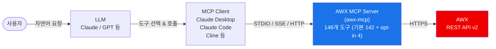

# AWX MCP Server

[English](README.md) | [🇯🇵 日本語](README.ja.md)


LLM이 AWX 인스턴스와 상호작용할 수 있도록 하는 MCP(Model Context Protocol) 서버입니다.

**146개의 도구**를 통해 인벤토리, 호스트, 프로젝트, 작업 템플릿, 워크플로우, 자격 증명, 실행 환경, RBAC, 시스템 관리 등 AWX의 모든 주요 기능을 지원합니다.

> 기본값으로는 142개 도구가 등록됩니다. 나머지 4개(`create_credential`, `update_credential`, `create_user`, `update_user`)는 Form mode elicitation으로 민감 데이터를 수집하므로 `AWX_MCP_ENABLE_CREDENTIAL_MANAGEMENT=true`를 설정해야만 활성화됩니다. 자세한 내용은 [Credential Management (opt-in)](#credential-management-opt-in) 섹션을 참고하세요.

---

## 목차

- [빠른 시작](#빠른-시작)
- [사전 요구사항](#사전-요구사항)
- [아키텍처](#아키텍처)
- [호환성](#호환성)
- [주요 기능](#주요-기능)
- [설치](#설치)
- [설정](#설정)
- [Credential Management (opt-in)](#credential-management-opt-in)
- [MCP 클라이언트 연동](#mcp-클라이언트-연동)
- [사용 예시](#사용-예시)
- [도구 목록](#도구-목록)
- [트러블슈팅](#트러블슈팅)
- [기여하기](#기여하기)
- [행동 강령](#행동-강령)
- [변경 이력](#변경-이력)
- [보안 정책](#보안-정책)
- [라이선스](#라이선스)

---

## 빠른 시작

이 서버는 [uv](https://docs.astral.sh/uv/)를 사용하여 로컬 클론에서 실행합니다. 저장소를 클론하고 의존성을 한 번 동기화하세요:

```bash
git clone https://github.com/lycorp-jp/awx-mcp
cd awx-mcp
uv sync          # .venv 생성 및 의존성 설치
```

이후 MCP 클라이언트에서 `uv run --directory <경로>` 형태로 클론 경로를 지정합니다. `/path/to/awx-mcp`를 실제 클론 경로로 바꿔주세요.

### Claude Desktop (`claude_desktop_config.json`)

```json
{
  "mcpServers": {
    "awx": {
      "command": "uv",
      "args": ["run", "--directory", "/path/to/awx-mcp", "awx-mcp"],
      "env": {
        "ANSIBLE_BASE_URL": "https://awx.example.com/",
        "ANSIBLE_TOKEN": "your_api_token"
      }
    }
  }
}
```

### Claude Code (CLI)

```bash
claude mcp add awx \
  -e ANSIBLE_BASE_URL=https://awx.example.com/ \
  -e ANSIBLE_TOKEN=your_api_token \
  -- uv run --directory /path/to/awx-mcp awx-mcp
```

설정 완료 후 LLM에게 "AWX에 등록된 인벤토리 목록을 보여줘" 같은 자연어로 요청하면 됩니다.

---

## 사전 요구사항

- 접근 가능한 AWX 인스턴스 및 해당 기본 URL (REST API v2), 그리고 적절한 권한이 있는 API 토큰 (또는 사용자명 + 비밀번호)
- [uv](https://docs.astral.sh/uv/)

---

## 아키텍처



> LLM이 사용자 요청을 분석하여 적절한 MCP 도구를 선택하고, AWX MCP 서버가 AWX REST API를 호출하여 결과를 반환합니다.

> 이 서버는 **STDIO** (기본값), **SSE**, **Streamable HTTP** 트랜스포트를 지원합니다. 로컬 MCP 클라이언트에는 STDIO를, 원격 또는 공유 배포에는 SSE 또는 Streamable HTTP를 사용하세요.

---

## 호환성

| 컴포넌트 | 지원 버전 |
|---------|---------|
| AWX | 24.6.1 (REST API v2) |
| Python | ≥ 3.10 |
| MCP transport | STDIO, SSE, Streamable HTTP |

---

## 주요 기능

### AWX 리소스 관리

인벤토리·호스트·그룹·잡 템플릿·잡·프로젝트·워크플로·자격증명·RBAC·조직/팀/사용자·실행환경·스케줄·시스템 관리를 아우릅니다. 전체 도구 목록은 [도구 목록](#도구-목록)을 참고하세요.

### 기술적 특징

- **모듈별 디렉토리 구조**: 20개 도메인 모듈로 분리하여 코드 가독성 및 유지보수성 향상
- **토큰 캐시**: username/password 인증 시 토큰을 재사용하여 불필요한 토큰 생성 방지
- **페이지네이션 제어**: `limit` 파라미터로 응답당 레코드 수를 제한해 큰 결과셋이 LLM 컨텍스트를 넘치지 않게 한다
- **기본값 안전 (Safe by default)**: 민감 데이터를 다루는 4개의 자격 증명/사용자 쓰기 도구는 `AWX_MCP_ENABLE_CREDENTIAL_MANAGEMENT=true` 설정이 없으면 등록되지 않습니다. 기본 배포는 민감 데이터를 다루는 도구를 노출하지 않습니다 — [Credential Management (opt-in)](#credential-management-opt-in) 섹션 참조
- **도구 파라미터 노출 감소 (opt-in 활성화 시)**: 자격 증명 입력 및 비밀번호를 [MCP Elicitation](https://modelcontextprotocol.io/specification/2025-11-25/client/elicitation) (Form mode)으로 수집하여 도구 파라미터로 전달되지 않도록 합니다
- **읽기 전용 모드**: `AWX_MCP_READ_ONLY=true`를 설정하면 시작 시 읽기 도구(`list_*`/`get_*`)만 노출됩니다

---

## 설치

이 서버는 패키지 인덱스에 게시되지 않습니다 — [uv](https://docs.astral.sh/uv/)를 사용하여 로컬 클론에서 실행하세요.

```bash
# 1. 저장소 클론
git clone https://github.com/lycorp-jp/awx-mcp
cd awx-mcp

# 2. 의존성 동기화 (.venv 자동 생성)
uv sync

# 3. 필수 환경변수 설정
export ANSIBLE_BASE_URL="https://awx.example.com/"
export ANSIBLE_TOKEN="your_api_token"

# 4a. stdio로 실행 (기본값 — 로컬 MCP 클라이언트용)
uv run awx-mcp

# 4b. Streamable HTTP로 실행 (원격/공유 접근용)
uv run awx-mcp --transport streamable-http --host 127.0.0.1 --port 8000
#    엔드포인트: http://127.0.0.1:8000/mcp

# 4c. SSE로 실행
uv run awx-mcp --transport sse --port 8000
#    엔드포인트: http://127.0.0.1:8000/sse
```

MCP 클라이언트 설정 시 `--directory`로 클론 경로를 지정하여 어느 디렉토리에서나 실행할 수 있습니다:

```bash
uv run --directory /path/to/awx-mcp awx-mcp
```

**CLI 플래그** (`--transport`, `--host`, `--port`)는 `AWX_MCP_TRANSPORT`, `AWX_MCP_HOST`, `AWX_MCP_PORT` 환경변수보다 우선합니다.

> stdio는 보통 MCP 클라이언트가 프로세스를 자동으로 실행합니다([MCP 클라이언트 연동](#mcp-클라이언트-연동) 참조). 직접 실행할 필요가 없습니다.

---

## 설정

환경변수로 AWX 접속 정보를 설정합니다. MCP 클라이언트 설정의 `env` 블록에 직접 넣으면 됩니다.

### 필수 환경 변수

| 변수 | 설명 | 예시 |
|------|------|------|
| `ANSIBLE_BASE_URL` | AWX 인스턴스 URL (끝 `/` 선택) | `https://awx.example.com` |

### 인증 (둘 중 하나 선택)

**방법 1: API 토큰 (권장)**

AWX UI에서 미리 생성한 토큰을 사용합니다. 토큰이 만료되지 않아 안정적입니다.

| 변수 | 설명 |
|------|------|
| `ANSIBLE_TOKEN` | 사전 생성된 API 토큰 |

> AWX UI에서 토큰 생성: 사용자 프로필 > 토큰 > 추가 > Scope: Write

**방법 2: 사용자명 + 비밀번호**

서버가 자동으로 OAuth2 토큰을 생성하고 캐시합니다.

| 변수 | 설명 |
|------|------|
| `ANSIBLE_USERNAME` | AWX 사용자명 |
| `ANSIBLE_PASSWORD` | AWX 비밀번호 |

### 선택 환경 변수

| 변수 | 기본값 | 설명 |
|------|--------|------|
| `ANSIBLE_SSL_VERIFY` | `true` | TLS 인증서 검증 (`true`/`false`). 검증은 **기본적으로 켜져 있습니다**. `false`로 설정하면 검증이 비활성화됩니다 (**보안 취약** — 경고가 로깅됩니다. CA 번들이 없는 개발/자체 서명 환경에서만 사용하세요). |
| `ANSIBLE_CA_BUNDLE` | 미설정 | 검증이 활성화된 상태에서 신뢰할 커스텀 CA 번들/자체 서명 인증서(PEM) 경로. 검증을 끄지 않고도 사설 CA를 사용하는 AWX 인스턴스에 연결할 수 있습니다. 경로가 존재하지 않으면 서버가 시작 시 즉시 실패합니다. |
| `ANSIBLE_LOG_LEVEL` | `INFO` | 로그 레벨 (`DEBUG`, `INFO`, `WARNING`, `ERROR`) |
| `AWX_MCP_ENABLE_CREDENTIAL_MANAGEMENT` | `false` | Form mode elicitation으로 민감 데이터를 수집하는 자격 증명/사용자 쓰기 도구 4개의 활성화 여부. [Credential Management (opt-in)](#credential-management-opt-in) 섹션 참조. |
| `AWX_MCP_READ_ONLY` | `false` | `true`로 설정하면 시작 시 모든 쓰기/파괴적 도구가 등록 해제되고 읽기 전용 도구(`list_*`/`get_*`)만 노출됩니다. 안전한 조회 또는 감사 전용 자동화에 유용합니다. |
| `AWX_MCP_TRANSPORT` | `stdio` | MCP 트랜스포트 종류: `stdio`, `sse`, `streamable-http`. |
| `AWX_MCP_HOST` | `127.0.0.1` | `sse` 및 `streamable-http` 트랜스포트의 바인드 호스트. |
| `AWX_MCP_PORT` | `8000` | `sse` 및 `streamable-http` 트랜스포트의 바인드 포트. |
| `AWX_MCP_TLS_ENABLE` | `false` | `true`로 설정하면 `sse`/`streamable-http` 서버가 프로세스 내에서 HTTPS로 서빙합니다 (uvicorn). `stdio`에서는 무시됩니다 (네트워크 소켓이 없으며 경고가 로깅됩니다). |
| `AWX_MCP_TLS_CERT` | 미설정 | 서버 TLS 인증서(PEM) 경로. 네트워크 트랜스포트에서 `AWX_MCP_TLS_ENABLE=true`일 때 필수이며, 경로가 없거나 찾을 수 없으면 서버가 시작 시 즉시 실패합니다. |
| `AWX_MCP_TLS_KEY` | 미설정 | 서버 TLS 개인 키(PEM) 경로. TLS가 활성화되면 필수입니다. |
| `AWX_MCP_TLS_KEY_PASSWORD` | 미설정 | 개인 키가 암호화된 경우의 비밀번호. 선택 사항. |
| `AWX_MCP_USAGE_LOG_FILE` | 미설정 | JSON Lines 형식의 사용 로그 파일 경로. MCP 도구 호출마다 하나의 JSON 문서(`@timestamp`, `user`, `tool`, `kind`, `trace_id`, `server_version`, `success`, `latency_ms`, `transport`, `awx_host`, 실패 시 `error{type,message}`)가 기록됩니다. 미설정 시 파일이 생성되지 않고 계측 자체가 비활성화됩니다. [상세 사용 로그](#상세-사용-로그) 섹션 참조. |
| `AWX_MCP_SERVER_LOG_FILE` | 미설정 | 서버 진단 로그 파일 경로. 기존 stderr 진단/에러 출력을 그대로 파일에도 기록합니다. 미설정 시 stderr에만 출력되고 파일은 생성되지 않습니다. |
| `AWX_MCP_SERVER_LOG_FORMAT` | `plain` | 서버 진단 로그 형식: `plain` 또는 `json`. |
| `AWX_MCP_LOG_BACKUP_COUNT` | `7` | 로테이션된 로그 파일 보관 개수. 두 로그 파일 모두 매일 자정(UTC)에 날짜 접미사를 붙여 로테이션됩니다. |

### TLS / 인증서 검증

TLS 인증서 검증은 **기본적으로 켜져 있습니다** (`ANSIBLE_SSL_VERIFY=true`). AWX 인스턴스가 사설/내부 CA가 발급한 인증서(또는 자체 서명 인증서)를 사용한다면, `ANSIBLE_CA_BUNDLE`에 CA 번들(PEM) 경로를 설정하세요 — 검증을 비활성화하지 않고도 해당 CA를 신뢰하게 되며, 이는 검증 비활성화보다 권장되는 방법입니다.

`ANSIBLE_SSL_VERIFY=false`로 설정하면 검증이 완전히 비활성화됩니다. 이 값을 사용할 때마다 서버가 경고를 로깅하며, 개발 환경에서만 사용해야 합니다. 스킴이 없는 `ANSIBLE_BASE_URL` 호스트는 자동으로 `https://`로 승격됩니다. 명시적인 `http://` URL은 그대로 사용되지만, API 토큰이 암호화되지 않은 채 전송되므로 서버가 경고를 로깅합니다.

### HTTPS로 서빙 (인바운드 TLS)

이는 **인바운드** TLS입니다 — MCP 클라이언트에서 이 서버로의 연결을 암호화하는 것으로, `ANSIBLE_SSL_VERIFY`가 제어하는 아웃바운드 AWX 인증서 검증과는 방향이 다릅니다. 두 가지를 혼동하지 마세요.

`sse`와 `streamable-http` 트랜스포트에만 적용됩니다. `stdio`는 네트워크 소켓이 없는 로컬 파이프이므로 TLS가 적용되지 않으며, 보안은 프로세스/호스트 격리에서 나옵니다.

활성화하려면 `AWX_MCP_TLS_ENABLE=true`와 함께 `AWX_MCP_TLS_CERT`, `AWX_MCP_TLS_KEY`를 설정하세요 (키가 암호화된 경우 `AWX_MCP_TLS_KEY_PASSWORD`도 설정):

```bash
export AWX_MCP_TLS_ENABLE=true
export AWX_MCP_TLS_CERT=/path/to/server.crt
export AWX_MCP_TLS_KEY=/path/to/server.key
uv run awx-mcp --transport streamable-http --host 0.0.0.0 --port 8443
```

**중요:** HTTPS는 트래픽만 암호화할 뿐, *누가* 접속하는지는 인증하지 않습니다. 이 서버는 요청 단위의 클라이언트 인증이 없으며, 모든 AWX 호출에 단일 `ANSIBLE_TOKEN`을 사용합니다. 네트워크에 노출된 HTTPS 엔드포인트는 네트워크 정책, 방화벽, 또는 인증 기능을 갖춘 리버스 프록시로 여전히 보호해야 합니다. 쿠버네티스에서는 보통 ingress에서 TLS를 종료하는 방식을 사용하며, 파드까지 종단 간 암호화가 필요한 경우에만 프로세스 내 TLS가 필요합니다.

### 상세 사용 로그

사용 로그는 opt-in 방식입니다. `AWX_MCP_USAGE_LOG_FILE`에 쓰기 가능한 경로를 설정하면, 도구 호출마다 하나의 JSON 문서를 [JSON Lines](https://jsonlines.org/) 형식으로 기록하기 시작합니다. 이 형식은 Filebeat, Fluentd 등 외부 로그 수집기가 나중에 수집·통계 처리하기 쉽도록 설계되었습니다. 로그는 stdout으로 절대 출력되지 않습니다 — MCP stdio 트랜스포트는 stdout을 프로토콜 메시지 전송에 사용하므로, 여기에 로그를 쓰면 프로토콜 스트림이 손상됩니다. 서버 자체는 로그 데이터를 네트워크로 전송하지 않으며, 설정한 로컬 파일에만 기록합니다.

각 항목에는 `kind` 필드도 포함됩니다: 일반 MCP 도구 호출은 `"tool"`, 서버가 시작 시 한 번 호출하는 `/api/v2/me/` 사용자 확인 요청은 `"internal_api"`(`tool: "GET /api/v2/me/"`로 기록)로 구분됩니다. 이를 통해 통계에서 실제 도구 사용량과 내부 오버헤드를 분리할 수 있습니다.

---

## Credential Management (opt-in)

4개의 도구 — `create_credential`, `update_credential`, `create_user`, `update_user` — 는 **Form mode elicitation**을 통해 민감 데이터(비밀번호, 자격 증명 입력)를 수집합니다. 이 도구들은 기본적으로 **등록되지 않으므로**, 기본 142개 도구는 민감 데이터를 다루는 도구를 전혀 노출하지 않습니다.

활성화하려면 다음을 설정하세요:

```bash
AWX_MCP_ENABLE_CREDENTIAL_MANAGEMENT=true
```

Form mode elicitation은 MCP 스펙 관점에서 민감 데이터에 대해 비준수 상태입니다 — 응답이 클라이언트 측 로깅이나 기타 중간 시스템을 통해 노출될 수 있습니다. 신뢰할 수 있는 격리된 환경에서만 활성화하세요. 전체 위협 모델 및 공개 정책은 [SECURITY.md](./SECURITY.md)를 참고하세요.

---

## MCP 클라이언트 연동

### Claude Desktop

`claude_desktop_config.json`에 다음을 추가합니다:

```json
{
  "mcpServers": {
    "awx": {
      "command": "uv",
      "args": ["run", "--directory", "/path/to/awx-mcp", "awx-mcp"],
      "env": {
        "ANSIBLE_BASE_URL": "https://awx.example.com/",
        "ANSIBLE_TOKEN": "your_api_token"
      }
    }
  }
}
```

### Claude Code (CLI)

```bash
claude mcp add awx \
  -e ANSIBLE_BASE_URL=https://awx.example.com/ \
  -e ANSIBLE_TOKEN=your_api_token \
  -- uv run --directory /path/to/awx-mcp awx-mcp
```

### Cline (VS Code)

MCP 서버 설정에 다음을 추가합니다:

```json
{
  "awx": {
    "command": "uv",
    "args": ["run", "--directory", "/path/to/awx-mcp", "awx-mcp"],
    "env": {
      "ANSIBLE_BASE_URL": "https://awx.example.com/",
      "ANSIBLE_TOKEN": "your_api_token"
    }
  }
}
```

### HTTP & SSE 트랜스포트

서버를 `--transport streamable-http` 또는 `--transport sse`로 실행 중일 때는 서브프로세스 명령어 대신 HTTP 엔드포인트를 MCP 클라이언트에 지정합니다.

**Streamable HTTP** (엔드포인트: `http://host:8000/mcp`):

```json
{
  "mcpServers": {
    "awx": { "type": "streamable-http", "url": "http://127.0.0.1:8000/mcp" }
  }
}
```

**SSE** (엔드포인트: `http://host:8000/sse`):

```json
{
  "mcpServers": {
    "awx": { "type": "sse", "url": "http://127.0.0.1:8000/sse" }
  }
}
```

> **보안 (중요):** HTTP/SSE 트랜스포트에는 **기본 인증이 없습니다**. 서버는 기본적으로 `127.0.0.1` (루프백)에 바인드됩니다. 루프백이 아닌 주소에 바인드하면 서버가 경고를 로깅합니다. 네트워크에 노출하는 경우 **인증 기능을 갖춘 TLS 리버스 프록시** 뒤에 배치하고 방화벽으로 포트를 제한하세요. 신뢰할 수 없는 네트워크에 직접 노출하지 마세요.

---

## 사용 예시

MCP 클라이언트(Claude 등)에 자연어로 요청하면 서버가 적절한 도구를 호출합니다.

### 인벤토리 관리

```
"Production 인벤토리의 호스트 목록을 보여줘"
→ list_hosts(inventory_id=1) 호출

"web-server-01 호스트를 Production 인벤토리에 추가해줘"
→ create_host(name="web-server-01", inventory_id=1) 호출

"DB 서버들을 database 그룹으로 묶어줘"
→ create_group(...) + add_host_to_group(...) 호출
```

### 작업 실행 및 모니터링

```
"Deploy App 작업 템플릿을 실행해줘"
→ launch_job(template_id=5) 호출

"방금 실행한 작업의 진행 상황을 확인해줘"
→ get_job(job_id=123) 호출

"작업 실행 로그를 보여줘"
→ get_job_stdout(job_id=123) 호출

"실패한 작업을 재실행해줘"
→ relaunch_job(job_id=123) 호출
```

### 프로젝트 & SCM

```
"모든 프로젝트를 최신 상태로 동기화해줘"
→ list_projects() + sync_project(project_id=...) 반복 호출

"my-project에 있는 플레이북 목록을 보여줘"
→ list_project_playbooks(project_id=3) 호출
```

### 워크플로우

```
"배포 워크플로우를 실행하고 승인이 필요하면 승인해줘"
→ launch_workflow(template_id=10) 호출
→ list_workflow_approvals() → approve_workflow(approval_id=...) 호출

"워크플로우 실행 결과에서 실패한 노드를 확인해줘"
→ list_workflow_job_nodes(workflow_job_id=50) 호출
```

### RBAC & 사용자 관리

```
"developer 팀에 Production 인벤토리 읽기 권한을 부여해줘"
→ list_object_roles(...) + grant_role_to_team(role_id=..., team_id=...) 호출

"새 사용자 john을 생성하고 DevOps 팀에 추가해줘"
→ create_user(...) + grant_role_to_user(...) 호출
```

### 시스템 관리

```
"AWX 버전과 클러스터 상태를 확인해줘"
→ get_ansible_version() + list_instances() 호출

"90일 이전의 오래된 작업 기록을 정리해줘"
→ list_system_job_templates() → launch_system_job(template_id=..., extra_vars='{"days": 90}') 호출
```

---

## 도구 목록

총 **146개** 도구를 20개 모듈로 제공합니다. 기본값으로 142개가 등록되며, 아래에서 **opt-in**으로 표시된 4개는 `AWX_MCP_ENABLE_CREDENTIAL_MANAGEMENT=true` 설정 시에만 노출됩니다([Credential Management (opt-in)](#credential-management-opt-in) 섹션 참조).

<details>
<summary><strong>전체 146개 도구 보기</strong></summary>

### 인벤토리 & 인벤토리 소스 관리 (14개) - `inventories.py`

| 도구 | 설명 |
|------|------|
| `list_inventories` | 모든 인벤토리 목록 조회 |
| `get_inventory` | 특정 인벤토리 상세 조회 |
| `create_inventory` | 새 인벤토리 생성 |
| `update_inventory` | 인벤토리 수정 |
| `delete_inventory` | 인벤토리 삭제 |
| `list_inventory_sources` | 인벤토리 소스 목록 |
| `get_inventory_source` | 특정 인벤토리 소스 상세 조회 |
| `create_inventory_source` | 새 인벤토리 소스 생성 |
| `update_inventory_source` | 인벤토리 소스 수정 |
| `sync_inventory_source` | 인벤토리 소스 동기화 |
| `delete_inventory_source` | 인벤토리 소스 삭제 |
| `list_inventory_updates` | 인벤토리 업데이트(동기화) 기록 조회 |
| `get_inventory_update` | 특정 인벤토리 업데이트 상세 조회 |
| `cancel_inventory_update` | 실행 중인 인벤토리 업데이트 취소 |

### 호스트 관리 (5개) - `hosts.py`

| 도구 | 설명 |
|------|------|
| `list_hosts` | 호스트 목록 (인벤토리 필터 가능) |
| `get_host` | 특정 호스트 상세 조회 |
| `create_host` | 새 호스트 생성 (변수 포함) |
| `update_host` | 호스트 수정 |
| `delete_host` | 호스트 삭제 |

### 그룹 관리 (7개) - `groups.py`

| 도구 | 설명 |
|------|------|
| `list_groups` | 인벤토리 내 그룹 목록 |
| `get_group` | 특정 그룹 상세 조회 |
| `create_group` | 새 그룹 생성 (변수 포함) |
| `update_group` | 그룹 수정 |
| `delete_group` | 그룹 삭제 |
| `add_host_to_group` | 호스트를 그룹에 추가 |
| `remove_host_from_group` | 그룹에서 호스트 제거 |

### 작업 템플릿 관리 (13개) - `job_templates.py`

| 도구 | 설명 |
|------|------|
| `list_job_templates` | 모든 작업 템플릿 목록 |
| `get_job_template` | 특정 작업 템플릿 상세 조회 |
| `create_job_template` | 새 작업 템플릿 생성 |
| `update_job_template` | 작업 템플릿 수정 |
| `delete_job_template` | 작업 템플릿 삭제 |
| `launch_job` | 작업 템플릿에서 작업 실행 |
| `copy_job_template` | 작업 템플릿 복사 |
| `get_job_template_survey` | 작업 템플릿 설문 조회 |
| `set_job_template_survey` | 작업 템플릿 설문 설정 |
| `delete_job_template_survey` | 작업 템플릿 설문 삭제 |
| `list_template_credentials` | 템플릿에 연결된 자격 증명 목록 |
| `associate_credential_with_template` | 템플릿에 자격 증명 연결 |
| `disassociate_credential_from_template` | 템플릿에서 자격 증명 해제 |

### 작업 관리 (7개) - `jobs.py`

| 도구 | 설명 |
|------|------|
| `list_jobs` | 작업 목록 (상태 필터 가능) |
| `get_job` | 특정 작업 상세 조회 |
| `cancel_job` | 실행 중인 작업 취소 |
| `relaunch_job` | 완료/실패된 작업 재실행 |
| `get_job_events` | 작업 이벤트 목록 |
| `get_job_stdout` | 작업 표준 출력 (txt/html/json/ansi) |
| `get_job_host_summaries` | 호스트별 작업 결과 요약 |

### 프로젝트 관리 (11개) - `projects.py`

| 도구 | 설명 |
|------|------|
| `list_projects` | 모든 프로젝트 목록 |
| `get_project` | 특정 프로젝트 상세 조회 |
| `create_project` | 새 프로젝트 생성 (Git/SVN/Hg/수동) |
| `update_project` | 프로젝트 수정 |
| `delete_project` | 프로젝트 삭제 |
| `sync_project` | SCM 소스와 프로젝트 동기화 |
| `list_project_playbooks` | 프로젝트 내 플레이북 목록 |
| `list_project_updates` | 프로젝트 업데이트(동기화) 기록 조회 |
| `get_project_update` | 특정 프로젝트 업데이트 상세 조회 |
| `cancel_project_update` | 실행 중인 프로젝트 업데이트 취소 |
| `get_project_update_stdout` | 프로젝트 업데이트 표준 출력 |

### 자격 증명 관리 (7개: 기본 5 + opt-in 2) - `credentials.py`

| 도구 | 설명 |
|------|------|
| `list_credentials` | 모든 자격 증명 목록 |
| `get_credential` | 특정 자격 증명 상세 조회 |
| `list_credential_types` | 자격 증명 유형 목록 |
| `create_credential` | **opt-in.** 새 자격 증명 생성 (elicitation으로 민감 입력 수집) |
| `update_credential` | **opt-in.** 자격 증명 수정 (elicitation으로 민감 입력 수집 가능) |
| `delete_credential` | 자격 증명 삭제 |
| `copy_credential` | 자격 증명 복사 |

### 조직 관리 (5개) - `organizations.py`

| 도구 | 설명 |
|------|------|
| `list_organizations` | 모든 조직 목록 |
| `get_organization` | 특정 조직 상세 조회 |
| `create_organization` | 새 조직 생성 |
| `update_organization` | 조직 수정 |
| `delete_organization` | 조직 삭제 |

### 팀 관리 (5개) - `teams.py`

| 도구 | 설명 |
|------|------|
| `list_teams` | 팀 목록 (조직 필터 가능) |
| `get_team` | 특정 팀 상세 조회 |
| `create_team` | 새 팀 생성 |
| `update_team` | 팀 수정 |
| `delete_team` | 팀 삭제 |

### 사용자 관리 (5개: 기본 3 + opt-in 2) - `users.py`

| 도구 | 설명 |
|------|------|
| `list_users` | 모든 사용자 목록 |
| `get_user` | 특정 사용자 상세 조회 |
| `create_user` | **opt-in.** 새 사용자 생성 (elicitation으로 비밀번호 수집) |
| `update_user` | **opt-in.** 사용자 수정 (elicitation으로 비밀번호 수집 가능) |
| `delete_user` | 사용자 삭제 |

### Ad Hoc 명령 (3개) - `ad_hoc.py`

| 도구 | 설명 |
|------|------|
| `run_ad_hoc_command` | Ad hoc Ansible 명령 실행 |
| `get_ad_hoc_command` | Ad hoc 명령 상세 조회 |
| `cancel_ad_hoc_command` | 실행 중인 Ad hoc 명령 취소 |

### 워크플로우 템플릿 & 노드 관리 (17개) - `workflow_templates.py`

| 도구 | 설명 |
|------|------|
| `list_workflow_templates` | 모든 워크플로우 템플릿 목록 |
| `get_workflow_template` | 특정 워크플로우 템플릿 상세 조회 |
| `create_workflow_template` | 새 워크플로우 템플릿 생성 |
| `update_workflow_template` | 워크플로우 템플릿 수정 |
| `delete_workflow_template` | 워크플로우 템플릿 삭제 |
| `launch_workflow` | 워크플로우 실행 |
| `copy_workflow_template` | 워크플로우 템플릿 복사 |
| `get_workflow_template_survey` | 워크플로우 설문 조회 |
| `set_workflow_template_survey` | 워크플로우 설문 설정 |
| `delete_workflow_template_survey` | 워크플로우 설문 삭제 |
| `list_workflow_template_nodes` | 워크플로우 노드 목록 |
| `get_workflow_template_node` | 특정 노드 상세 조회 |
| `create_workflow_template_node` | 새 노드 생성 |
| `delete_workflow_template_node` | 노드 삭제 |
| `add_workflow_node_success_link` | 성공 시 실행할 노드 연결 |
| `add_workflow_node_failure_link` | 실패 시 실행할 노드 연결 |
| `add_workflow_node_always_link` | 항상 실행할 노드 연결 |

### 워크플로우 작업 & 승인 (11개) - `workflow_jobs.py`

| 도구 | 설명 |
|------|------|
| `list_workflow_jobs` | 워크플로우 작업 목록 (상태 필터 가능) |
| `get_workflow_job` | 특정 워크플로우 작업 상세 조회 |
| `cancel_workflow_job` | 실행 중인 워크플로우 작업 취소 |
| `relaunch_workflow_job` | 완료/실패된 워크플로우 작업 재실행 |
| `list_workflow_job_nodes` | 실행된 워크플로우의 노드 목록 (디버깅용) |
| `list_workflow_approvals` | 워크플로우 승인 요청 목록 |
| `get_workflow_approval` | 특정 승인 요청 상세 조회 |
| `approve_workflow` | 워크플로우 승인 |
| `deny_workflow` | 워크플로우 거부 |
| `list_workflow_approval_templates` | 워크플로우 승인 템플릿 목록 |
| `get_workflow_approval_template` | 특정 승인 템플릿 상세 조회 |

### 스케줄 관리 (5개) - `schedules.py`

| 도구 | 설명 |
|------|------|
| `list_schedules` | 스케줄 목록 (템플릿 필터 가능) |
| `get_schedule` | 특정 스케줄 상세 조회 |
| `create_schedule` | 새 스케줄 생성 (iCal rrule) |
| `update_schedule` | 스케줄 수정 |
| `delete_schedule` | 스케줄 삭제 |

### 실행 환경 (5개) - `execution_environments.py`

| 도구 | 설명 |
|------|------|
| `list_execution_environments` | 실행 환경 목록 |
| `get_execution_environment` | 특정 실행 환경 상세 조회 |
| `create_execution_environment` | 새 실행 환경 생성 |
| `update_execution_environment` | 실행 환경 수정 |
| `delete_execution_environment` | 실행 환경 삭제 |

### 알림 템플릿 (3개) - `notifications.py`

| 도구 | 설명 |
|------|------|
| `list_notification_templates` | 알림 템플릿 목록 |
| `get_notification_template` | 특정 알림 템플릿 상세 조회 |
| `test_notification_template` | 테스트 알림 발송 |

### 라벨 관리 (2개) - `labels.py`

| 도구 | 설명 |
|------|------|
| `list_labels` | 라벨 목록 |
| `create_label` | 새 라벨 생성 |

### RBAC 역할 관리 (7개) - `rbac.py`

| 도구 | 설명 |
|------|------|
| `list_roles` | RBAC 역할 목록 |
| `get_role` | 특정 역할 상세 조회 |
| `grant_role_to_user` | 사용자에게 역할 부여 |
| `revoke_role_from_user` | 사용자에서 역할 해제 |
| `grant_role_to_team` | 팀에 역할 부여 |
| `revoke_role_from_team` | 팀에서 역할 해제 |
| `list_object_roles` | 특정 리소스의 RBAC 역할 목록 조회 |

### 인스턴스 관리 (4개) - `instances.py`

| 도구 | 설명 |
|------|------|
| `list_instances` | 클러스터 인스턴스 목록 |
| `get_instance` | 특정 인스턴스 상세 조회 |
| `list_instance_groups` | 인스턴스 그룹 목록 |
| `get_instance_group` | 특정 인스턴스 그룹 상세 조회 |

### 시스템 관리 (10개) - `system.py`

| 도구 | 설명 |
|------|------|
| `list_activity_stream` | 감사 기록 조회 (객체 유형/ID 필터링) |
| `get_config` | AWX 설정 정보 조회 |
| `get_ansible_version` | AWX 버전 정보 조회 |
| `get_dashboard_stats` | 대시보드 통계 조회 |
| `get_metrics` | 시스템 메트릭 조회 |
| `list_system_job_templates` | 시스템 작업 템플릿 목록 (정리, 분석 등) |
| `get_system_job_template` | 특정 시스템 작업 템플릿 상세 조회 |
| `launch_system_job` | 시스템 유지보수 작업 실행 |
| `list_system_jobs` | 시스템 작업 실행 기록 목록 |
| `get_system_job` | 특정 시스템 작업 상세 조회 |

</details>

---

## 트러블슈팅

### 서버가 시작되지 않아요

**`ValueError: ANSIBLE_BASE_URL environment variable is required`**

환경변수가 설정되지 않았습니다. MCP 클라이언트 설정의 `env` 블록에 `ANSIBLE_BASE_URL`을 추가하세요.

**`ValueError: Authentication is required`**

`ANSIBLE_TOKEN` 또는 `ANSIBLE_USERNAME` + `ANSIBLE_PASSWORD` 중 하나를 설정해야 합니다.

### 연결이 안 돼요

**SSL 인증서 오류**

TLS 검증은 기본적으로 켜져 있습니다. AWX 인스턴스가 사설/내부 CA가 발급한 인증서 또는 자체 서명 인증서를 사용한다면, `ANSIBLE_CA_BUNDLE`에 해당 CA/인증서의 PEM 파일 경로를 설정하세요 — 검증을 켠 채로 그 인증서를 신뢰하게 됩니다. CA 인증서를 구할 수 없는 등 최후의 수단으로만 `ANSIBLE_SSL_VERIFY`를 `"false"`(반드시 문자열)로 설정하세요. 이 경우 검증이 완전히 비활성화되며 서버가 경고를 로깅합니다. 자세한 내용은 위의 **TLS / 인증서 검증** 섹션을 참고하세요.

**Connection refused / timeout**

- `ANSIBLE_BASE_URL`이 정확한지 확인하세요
- AWX 인스턴스가 실행 중인지 확인하세요
- 방화벽/네트워크 설정을 확인하세요

### MCP 스키마 오류

**`Does not adhere to MCP server configuration schema`**

`env` 블록의 모든 값은 **문자열**이어야 합니다. `false` (boolean) 대신 `"false"` (문자열)을 사용하세요.

### 권한 오류

**403 Forbidden**

API 토큰 또는 사용자 계정에 해당 리소스에 대한 권한이 없습니다. AWX 관리자에게 적절한 역할을 요청하세요.

### 디버깅

로그 레벨을 `DEBUG`로 설정하면 상세한 API 요청/응답 로그를 확인할 수 있습니다:

```json
"ANSIBLE_LOG_LEVEL": "DEBUG"
```

---

## 기여하기

기여를 환영합니다. 이슈 제출, 변경 제안, PR 오픈 방법은 [CONTRIBUTING.md](CONTRIBUTING.md)를 참고하세요.

## 행동 강령

이 프로젝트는 [행동 강령](CODE_OF_CONDUCT.md)을 따릅니다. 참여 시 해당 조항을 준수해야 합니다.

## 변경 이력

주요 변경 사항의 이력은 [CHANGELOG.md](CHANGELOG.md)를 참조하세요.

## 보안 정책

취약점 공개, 위협 모델, 보안 이력은 [SECURITY.md](SECURITY.md)를 참조하세요.

---

## 라이선스

Apache License 2.0 - 자세한 내용은 [LICENSE](LICENSE) 파일을 참조하세요.
