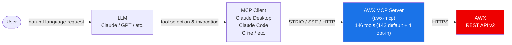

# AWX MCP Server


An MCP (Model Context Protocol) server that lets LLMs interact with AWX instances.

[🇰🇷 한국어](README.ko.md) | [🇯🇵 日本語](README.ja.md)

**146 tools** covering every major AWX capability: inventories, hosts, projects, job templates, workflows, credentials, execution environments, RBAC, and system administration.

> 142 tools are enabled by default. The remaining 4 (`create_credential`, `update_credential`, `create_user`, `update_user`) collect sensitive data via Form-mode elicitation and are gated behind `AWX_MCP_ENABLE_CREDENTIAL_MANAGEMENT=true`. See [Credential Management](#credential-management-opt-in).

---

## Table of Contents

- [Quick Start](#quick-start)
- [Prerequisites](#prerequisites)
- [Architecture](#architecture)
- [Compatibility](#compatibility)
- [Features](#features)
- [Installation](#installation)
- [Configuration](#configuration)
- [Credential Management (opt-in)](#credential-management-opt-in)
- [MCP Client Integration](#mcp-client-integration)
- [Usage Examples](#usage-examples)
- [Tools](#tools)
- [Troubleshooting](#troubleshooting)
- [Contributing](#contributing)
- [Code of Conduct](#code-of-conduct)
- [Changelog](#changelog)
- [Security Policy](#security-policy)
- [License](#license)

---

## Quick Start

This server runs from a local clone with [uv](https://docs.astral.sh/uv/). Clone the repo and sync dependencies once:

```bash
git clone https://github.com/lycorp-jp/awx-mcp
cd awx-mcp
uv sync          # creates .venv and installs dependencies
```

Then point your MCP client at the clone using `uv run --directory <path>`. Replace `/path/to/awx-mcp` with the absolute path to your clone.

### Claude Desktop (`claude_desktop_config.json`)

```json
{
  "mcpServers": {
    "awx": {
      "command": "uv",
      "args": ["run", "--directory", "/path/to/awx-mcp", "awx-mcp"],
      "env": {
        "ANSIBLE_BASE_URL": "https://awx.example.com/",
        "ANSIBLE_TOKEN": "your_api_token"
      }
    }
  }
}
```

### Claude Code (CLI)

```bash
claude mcp add awx \
  -e ANSIBLE_BASE_URL=https://awx.example.com/ \
  -e ANSIBLE_TOKEN=your_api_token \
  -- uv run --directory /path/to/awx-mcp awx-mcp
```

Once configured, ask the LLM in plain language: "Show me the list of inventories registered in AWX."

---

## Prerequisites

- A reachable AWX instance and its base URL (REST API v2), plus an API token (or username + password) with appropriate permissions
- [uv](https://docs.astral.sh/uv/)

---

## Architecture



> The LLM analyzes the user's request, selects the appropriate MCP tool, and the AWX MCP server calls the AWX REST API and returns the result.

> This server supports **STDIO** (default), **SSE**, and **Streamable HTTP** transports. Use STDIO for local MCP clients; use SSE or Streamable HTTP for remote or shared deployments.

---

## Compatibility

| Component | Supported |
|-----------|-----------|
| AWX | 24.6.1 (REST API v2) |
| Python | ≥ 3.10 |
| MCP transport | STDIO, SSE, Streamable HTTP |

---

## Features

### AWX Resource Management

Full management across inventories, hosts, groups, job templates, jobs, projects, workflows, credentials, RBAC, organizations/teams/users, execution environments, schedules, and system administration. See [Tools](#tools) for the full list.

### Technical Highlights

- **Modular directory structure**: 20 domain modules for clean separation of concerns and easier maintenance
- **Token caching**: reuses OAuth2 tokens when authenticating with username/password to avoid unnecessary token creation
- **Pagination control**: caps each response at the requested number of records via the `limit` parameter, so large result sets never flood the LLM context
- **Safe by default**: 4 credential/user write tools that collect sensitive data are not registered unless `AWX_MCP_ENABLE_CREDENTIAL_MANAGEMENT=true` is set. The default deployment exposes no tool that handles sensitive data — see [Credential Management](#credential-management-opt-in)
- **Reduced parameter exposure (when opt-in is enabled)**: credential inputs and passwords are collected via [MCP Elicitation](https://modelcontextprotocol.io/specification/2025-11-25/client/elicitation) (Form mode) instead of being passed as tool parameters
- **Read-only mode**: set `AWX_MCP_READ_ONLY=true` to expose only read tools (`list_*`/`get_*`) at startup

---

## Installation

This server is not published to any package index — run it from a local clone with [uv](https://docs.astral.sh/uv/).

```bash
# 1. Clone the repository
git clone https://github.com/lycorp-jp/awx-mcp
cd awx-mcp

# 2. Sync dependencies (creates .venv automatically)
uv sync

# 3. Set required environment variables
export ANSIBLE_BASE_URL="https://awx.example.com/"
export ANSIBLE_TOKEN="your_api_token"

# 4a. Run with stdio (default — for local MCP clients)
uv run awx-mcp

# 4b. Run with Streamable HTTP (for remote/shared access)
uv run awx-mcp --transport streamable-http --host 127.0.0.1 --port 8000
#    Endpoint: http://127.0.0.1:8000/mcp

# 4c. Run with SSE
uv run awx-mcp --transport sse --port 8000
#    Endpoint: http://127.0.0.1:8000/sse
```

When configuring an MCP client, run from any directory by passing the clone path with `--directory`:

```bash
uv run --directory /path/to/awx-mcp awx-mcp
```

**CLI flags** (`--transport`, `--host`, `--port`) override the `AWX_MCP_TRANSPORT`, `AWX_MCP_HOST`, and `AWX_MCP_PORT` environment variables.

> For stdio, you normally let the MCP client launch the process automatically (see [MCP Client Integration](#mcp-client-integration)) rather than running it by hand.

---

## Configuration

Set AWX connection details via environment variables. Put them directly in the `env` block of your MCP client config.

### Required

| Variable | Description | Example |
|----------|-------------|---------|
| `ANSIBLE_BASE_URL` | AWX instance URL (trailing `/` optional) | `https://awx.example.com` |

### Authentication (choose one)

**Option 1: API token (recommended)**

Use a token generated in advance from the AWX UI. Tokens don't expire, so this is the more stable option.

| Variable | Description |
|----------|-------------|
| `ANSIBLE_TOKEN` | Pre-generated API token |

> To generate a token in AWX: User Profile > Tokens > Add > Scope: Write

**Option 2: Username + password**

The server automatically creates and caches an OAuth2 token on your behalf.

| Variable | Description |
|----------|-------------|
| `ANSIBLE_USERNAME` | AWX username |
| `ANSIBLE_PASSWORD` | AWX password |

### Optional

| Variable | Default | Description |
|----------|---------|-------------|
| `ANSIBLE_SSL_VERIFY` | `true` | TLS certificate verification (`true`/`false`). Verification is **on by default**. Set to `false` to disable verification (**insecure** — a warning is logged; only for dev/self-signed setups without a CA bundle). |
| `ANSIBLE_CA_BUNDLE` | unset | Path to a custom CA bundle / self-signed certificate (PEM) to trust when verification is enabled. Lets you connect to an AWX instance with a private CA without disabling verification. The server fails fast at startup if the path doesn't exist. |
| `ANSIBLE_LOG_LEVEL` | `INFO` | Log level (`DEBUG`, `INFO`, `WARNING`, `ERROR`) |
| `AWX_MCP_ENABLE_CREDENTIAL_MANAGEMENT` | `false` | Opt-in for the 4 credential/user write tools that collect sensitive data via Form-mode elicitation. See [Credential Management](#credential-management-opt-in). |
| `AWX_MCP_READ_ONLY` | `false` | When `true`, all write/destructive tools are unregistered at startup; only read-only tools (`list_*`/`get_*`) are exposed. Useful for safe inspection or audit-only automation. |
| `AWX_MCP_TRANSPORT` | `stdio` | MCP transport to use: `stdio`, `sse`, or `streamable-http`. |
| `AWX_MCP_HOST` | `127.0.0.1` | Bind host for `sse` and `streamable-http` transports. |
| `AWX_MCP_PORT` | `8000` | Bind port for `sse` and `streamable-http` transports. |
| `AWX_MCP_USAGE_LOG_FILE` | unset | Path to a JSON Lines usage log; every MCP tool call is recorded as one JSON document (`@timestamp`, `user`, `tool`, `kind`, `trace_id`, `server_version`, `success`, `latency_ms`, `transport`, `awx_host`, `error{type,message}` on failure). Unset means no file is created and instrumentation is disabled. See [Verbose usage logging](#verbose-usage-logging). |
| `AWX_MCP_SERVER_LOG_FILE` | unset | Path to a server diagnostic log file, mirroring the existing stderr diagnostics and errors. Unset means stderr only, no file. |
| `AWX_MCP_SERVER_LOG_FORMAT` | `plain` | Server diagnostic log format: `plain` or `json`. |
| `AWX_MCP_LOG_BACKUP_COUNT` | `7` | Number of rotated log files to retain. Both log files rotate daily at midnight (UTC) with a date suffix. |

### TLS / certificate verification

TLS certificate verification is **on by default** (`ANSIBLE_SSL_VERIFY=true`). If your AWX instance uses a certificate issued by a private/internal CA (or a self-signed certificate), set `ANSIBLE_CA_BUNDLE` to the path of the CA bundle (PEM) — this lets the server trust it while keeping verification enabled, which is the recommended approach over disabling verification.

Setting `ANSIBLE_SSL_VERIFY=false` disables verification entirely; the server logs a warning whenever this is used, and it should only be done in development environments. A bare `ANSIBLE_BASE_URL` host with no scheme is automatically upgraded to `https://`; an explicit `http://` URL is honored but the server logs a warning since the API token would be sent unencrypted.

### Verbose usage logging

Usage logging is opt-in: set `AWX_MCP_USAGE_LOG_FILE` to a writable path to start recording one JSON document per tool call in [JSON Lines](https://jsonlines.org/) format, designed to be picked up by external log collectors (Filebeat, Fluentd, etc.) for later collection and statistics. Logs are never written to stdout — the MCP stdio transport uses stdout for protocol messages, so writing logs there would corrupt the protocol stream. No log data is sent over the network by the server itself; it only writes to the local file(s) you configure.

Each entry also carries a `kind` field: `"tool"` for regular MCP tool calls, and `"internal_api"` for the one-time `/api/v2/me/` user-resolution call the server makes at startup (recorded with `tool: "GET /api/v2/me/"`). This lets your statistics separate real tool usage from that internal overhead.

---

## Credential Management (opt-in)

Four tools — `create_credential`, `update_credential`, `create_user`, `update_user` — collect sensitive data (passwords, credential inputs) via **Form-mode elicitation**. They are **not registered** by default, so the default 142-tool surface exposes nothing that handles sensitive data.

To enable them, set:

```bash
AWX_MCP_ENABLE_CREDENTIAL_MANAGEMENT=true
```

Form-mode elicitation is not spec-compliant for sensitive data per the MCP specification — the response may still be exposed through client-side logging or other intermediate systems. Enable only in trusted, isolated environments. For the full threat model and disclosure policy, see [SECURITY.md](./SECURITY.md).

---

## MCP Client Integration

### Claude Desktop

Add to `claude_desktop_config.json`:

```json
{
  "mcpServers": {
    "awx": {
      "command": "uv",
      "args": ["run", "--directory", "/path/to/awx-mcp", "awx-mcp"],
      "env": {
        "ANSIBLE_BASE_URL": "https://awx.example.com/",
        "ANSIBLE_TOKEN": "your_api_token"
      }
    }
  }
}
```

### Claude Code (CLI)

```bash
claude mcp add awx \
  -e ANSIBLE_BASE_URL=https://awx.example.com/ \
  -e ANSIBLE_TOKEN=your_api_token \
  -- uv run --directory /path/to/awx-mcp awx-mcp
```

### Cline (VS Code)

Add to the MCP server config:

```json
{
  "awx": {
    "command": "uv",
    "args": ["run", "--directory", "/path/to/awx-mcp", "awx-mcp"],
    "env": {
      "ANSIBLE_BASE_URL": "https://awx.example.com/",
      "ANSIBLE_TOKEN": "your_api_token"
    }
  }
}
```

### HTTP & SSE transports

When the server is running with `--transport streamable-http` or `--transport sse`, point your MCP client at the HTTP endpoint instead of using a subprocess command.

**Streamable HTTP** (endpoint: `http://host:8000/mcp`):

```json
{
  "mcpServers": {
    "awx": { "type": "streamable-http", "url": "http://127.0.0.1:8000/mcp" }
  }
}
```

**SSE** (endpoint: `http://host:8000/sse`):

```json
{
  "mcpServers": {
    "awx": { "type": "sse", "url": "http://127.0.0.1:8000/sse" }
  }
}
```

> **Security (IMPORTANT):** The HTTP/SSE transports have **no built-in authentication**. By default the server binds to `127.0.0.1` (loopback only). If you bind to a non-loopback address the server logs a warning. For any network-exposed deployment, place the server behind an **authenticating TLS reverse proxy** and restrict port access with a firewall. Never expose the server directly to untrusted networks.

---

## Usage Examples

Send natural language requests to your MCP client (Claude, etc.) and the server calls the appropriate tools.

### Inventory management

```
"Show me the hosts in the Production inventory"
-> list_hosts(inventory_id=1)

"Add web-server-01 to the Production inventory"
-> create_host(name="web-server-01", inventory_id=1)

"Group the DB servers into a database group"
-> create_group(...) + add_host_to_group(...)
```

### Job execution and monitoring

```
"Run the Deploy App job template"
-> launch_job(template_id=5)

"Check the status of the job I just ran"
-> get_job(job_id=123)

"Show me the job execution log"
-> get_job_stdout(job_id=123)

"Rerun the failed job"
-> relaunch_job(job_id=123)
```

### Projects and SCM

```
"Sync all projects to the latest version"
-> list_projects() + sync_project(project_id=...) for each

"List the playbooks in my-project"
-> list_project_playbooks(project_id=3)
```

### Workflows

```
"Run the deployment workflow and approve it if approval is needed"
-> launch_workflow(template_id=10)
-> list_workflow_approvals() -> approve_workflow(approval_id=...)

"Check which nodes failed in the workflow run"
-> list_workflow_job_nodes(workflow_job_id=50)
```

### RBAC and user management

```
"Grant the developer team read access to the Production inventory"
-> list_object_roles(...) + grant_role_to_team(role_id=..., team_id=...)

"Create a new user john and add them to the DevOps team"
-> create_user(...) + grant_role_to_user(...)
```

### System administration

```
"Check the AWX version and cluster status"
-> get_ansible_version() + list_instances()

"Clean up job records older than 90 days"
-> list_system_job_templates() -> launch_system_job(template_id=..., extra_vars='{"days": 90}')
```

---

## Tools

**146 tools** across 20 modules. By default 142 are registered; the 4 marked **opt-in** below appear only when `AWX_MCP_ENABLE_CREDENTIAL_MANAGEMENT=true` (see [Credential Management](#credential-management-opt-in)).

<details>
<summary><strong>Show all 146 tools</strong></summary>

### Inventories & Inventory Sources (14) - `inventories.py`

| Tool | Description |
|------|-------------|
| `list_inventories` | List all inventories |
| `get_inventory` | Get details of a specific inventory |
| `create_inventory` | Create a new inventory |
| `update_inventory` | Update an inventory |
| `delete_inventory` | Delete an inventory |
| `list_inventory_sources` | List inventory sources |
| `get_inventory_source` | Get details of a specific inventory source |
| `create_inventory_source` | Create a new inventory source |
| `update_inventory_source` | Update an inventory source |
| `sync_inventory_source` | Sync an inventory source |
| `delete_inventory_source` | Delete an inventory source |
| `list_inventory_updates` | List inventory update (sync) history |
| `get_inventory_update` | Get details of a specific inventory update |
| `cancel_inventory_update` | Cancel a running inventory update |

### Host Management (5) - `hosts.py`

| Tool | Description |
|------|-------------|
| `list_hosts` | List hosts (filterable by inventory) |
| `get_host` | Get details of a specific host |
| `create_host` | Create a new host (with variables) |
| `update_host` | Update a host |
| `delete_host` | Delete a host |

### Group Management (7) - `groups.py`

| Tool | Description |
|------|-------------|
| `list_groups` | List groups within an inventory |
| `get_group` | Get details of a specific group |
| `create_group` | Create a new group (with variables) |
| `update_group` | Update a group |
| `delete_group` | Delete a group |
| `add_host_to_group` | Add a host to a group |
| `remove_host_from_group` | Remove a host from a group |

### Job Template Management (13) - `job_templates.py`

| Tool | Description |
|------|-------------|
| `list_job_templates` | List all job templates |
| `get_job_template` | Get details of a specific job template |
| `create_job_template` | Create a new job template |
| `update_job_template` | Update a job template |
| `delete_job_template` | Delete a job template |
| `launch_job` | Launch a job from a job template |
| `copy_job_template` | Copy a job template |
| `get_job_template_survey` | Get the survey for a job template |
| `set_job_template_survey` | Set the survey for a job template |
| `delete_job_template_survey` | Delete the survey from a job template |
| `list_template_credentials` | List credentials associated with a template |
| `associate_credential_with_template` | Associate a credential with a template |
| `disassociate_credential_from_template` | Remove a credential from a template |

### Job Management (7) - `jobs.py`

| Tool | Description |
|------|-------------|
| `list_jobs` | List jobs (filterable by status) |
| `get_job` | Get details of a specific job |
| `cancel_job` | Cancel a running job |
| `relaunch_job` | Relaunch a completed or failed job |
| `get_job_events` | List job events |
| `get_job_stdout` | Get job stdout (txt/html/json/ansi) |
| `get_job_host_summaries` | Get per-host job result summaries |

### Project Management (11) - `projects.py`

| Tool | Description |
|------|-------------|
| `list_projects` | List all projects |
| `get_project` | Get details of a specific project |
| `create_project` | Create a new project (Git/SVN/Hg/manual) |
| `update_project` | Update a project |
| `delete_project` | Delete a project |
| `sync_project` | Sync a project with its SCM source |
| `list_project_playbooks` | List playbooks in a project |
| `list_project_updates` | List project update (sync) history |
| `get_project_update` | Get details of a specific project update |
| `cancel_project_update` | Cancel a running project update |
| `get_project_update_stdout` | Get stdout from a project update |

### Credential Management (7: 5 default + 2 opt-in) - `credentials.py`

| Tool | Description |
|------|-------------|
| `list_credentials` | List all credentials |
| `get_credential` | Get details of a specific credential |
| `list_credential_types` | List credential types |
| `create_credential` | **opt-in.** Create a new credential (collects sensitive inputs via elicitation) |
| `update_credential` | **opt-in.** Update a credential (may collect sensitive inputs via elicitation) |
| `delete_credential` | Delete a credential |
| `copy_credential` | Copy a credential |

### Organization Management (5) - `organizations.py`

| Tool | Description |
|------|-------------|
| `list_organizations` | List all organizations |
| `get_organization` | Get details of a specific organization |
| `create_organization` | Create a new organization |
| `update_organization` | Update an organization |
| `delete_organization` | Delete an organization |

### Team Management (5) - `teams.py`

| Tool | Description |
|------|-------------|
| `list_teams` | List teams (filterable by organization) |
| `get_team` | Get details of a specific team |
| `create_team` | Create a new team |
| `update_team` | Update a team |
| `delete_team` | Delete a team |

### User Management (5: 3 default + 2 opt-in) - `users.py`

| Tool | Description |
|------|-------------|
| `list_users` | List all users |
| `get_user` | Get details of a specific user |
| `create_user` | **opt-in.** Create a new user (collects password via elicitation) |
| `update_user` | **opt-in.** Update a user (may collect password via elicitation) |
| `delete_user` | Delete a user |

### Ad Hoc Commands (3) - `ad_hoc.py`

| Tool | Description |
|------|-------------|
| `run_ad_hoc_command` | Run an ad hoc Ansible command |
| `get_ad_hoc_command` | Get details of an ad hoc command |
| `cancel_ad_hoc_command` | Cancel a running ad hoc command |

### Workflow Templates & Nodes (17) - `workflow_templates.py`

| Tool | Description |
|------|-------------|
| `list_workflow_templates` | List all workflow templates |
| `get_workflow_template` | Get details of a specific workflow template |
| `create_workflow_template` | Create a new workflow template |
| `update_workflow_template` | Update a workflow template |
| `delete_workflow_template` | Delete a workflow template |
| `launch_workflow` | Launch a workflow |
| `copy_workflow_template` | Copy a workflow template |
| `get_workflow_template_survey` | Get the survey for a workflow template |
| `set_workflow_template_survey` | Set the survey for a workflow template |
| `delete_workflow_template_survey` | Delete the survey from a workflow template |
| `list_workflow_template_nodes` | List nodes in a workflow template |
| `get_workflow_template_node` | Get details of a specific node |
| `create_workflow_template_node` | Create a new node |
| `delete_workflow_template_node` | Delete a node |
| `add_workflow_node_success_link` | Link a node to run on success |
| `add_workflow_node_failure_link` | Link a node to run on failure |
| `add_workflow_node_always_link` | Link a node to always run |

### Workflow Jobs & Approvals (11) - `workflow_jobs.py`

| Tool | Description |
|------|-------------|
| `list_workflow_jobs` | List workflow jobs (filterable by status) |
| `get_workflow_job` | Get details of a specific workflow job |
| `cancel_workflow_job` | Cancel a running workflow job |
| `relaunch_workflow_job` | Relaunch a completed or failed workflow job |
| `list_workflow_job_nodes` | List nodes from a workflow run (for debugging) |
| `list_workflow_approvals` | List pending workflow approval requests |
| `get_workflow_approval` | Get details of a specific approval request |
| `approve_workflow` | Approve a workflow |
| `deny_workflow` | Deny a workflow |
| `list_workflow_approval_templates` | List workflow approval templates |
| `get_workflow_approval_template` | Get details of a specific approval template |

### Schedule Management (5) - `schedules.py`

| Tool | Description |
|------|-------------|
| `list_schedules` | List schedules (filterable by template) |
| `get_schedule` | Get details of a specific schedule |
| `create_schedule` | Create a new schedule (iCal rrule) |
| `update_schedule` | Update a schedule |
| `delete_schedule` | Delete a schedule |

### Execution Environments (5) - `execution_environments.py`

| Tool | Description |
|------|-------------|
| `list_execution_environments` | List execution environments |
| `get_execution_environment` | Get details of a specific execution environment |
| `create_execution_environment` | Create a new execution environment |
| `update_execution_environment` | Update an execution environment |
| `delete_execution_environment` | Delete an execution environment |

### Notification Templates (3) - `notifications.py`

| Tool | Description |
|------|-------------|
| `list_notification_templates` | List notification templates |
| `get_notification_template` | Get details of a specific notification template |
| `test_notification_template` | Send a test notification |

### Label Management (2) - `labels.py`

| Tool | Description |
|------|-------------|
| `list_labels` | List labels |
| `create_label` | Create a new label |

### RBAC Role Management (7) - `rbac.py`

| Tool | Description |
|------|-------------|
| `list_roles` | List RBAC roles |
| `get_role` | Get details of a specific role |
| `grant_role_to_user` | Grant a role to a user |
| `revoke_role_from_user` | Revoke a role from a user |
| `grant_role_to_team` | Grant a role to a team |
| `revoke_role_from_team` | Revoke a role from a team |
| `list_object_roles` | List RBAC roles for a specific resource |

### Instance Management (4) - `instances.py`

| Tool | Description |
|------|-------------|
| `list_instances` | List cluster instances |
| `get_instance` | Get details of a specific instance |
| `list_instance_groups` | List instance groups |
| `get_instance_group` | Get details of a specific instance group |

### System Administration (10) - `system.py`

| Tool | Description |
|------|-------------|
| `list_activity_stream` | Query audit log (filterable by object type/ID) |
| `get_config` | Get AWX configuration |
| `get_ansible_version` | Get AWX version information |
| `get_dashboard_stats` | Get dashboard statistics |
| `get_metrics` | Get system metrics |
| `list_system_job_templates` | List system job templates (cleanup, analytics, etc.) |
| `get_system_job_template` | Get details of a specific system job template |
| `launch_system_job` | Launch a system maintenance job |
| `list_system_jobs` | List system job execution history |
| `get_system_job` | Get details of a specific system job |

</details>

---

## Troubleshooting

### Server won't start

**`ValueError: ANSIBLE_BASE_URL environment variable is required`**

The environment variable isn't set. Add `ANSIBLE_BASE_URL` to the `env` block in your MCP client config.

**`ValueError: Authentication is required`**

You need to set either `ANSIBLE_TOKEN` or both `ANSIBLE_USERNAME` and `ANSIBLE_PASSWORD`.

### Connection problems

**SSL certificate error**

TLS verification is on by default. If your AWX instance uses a certificate from a private/internal CA or a self-signed certificate, set `ANSIBLE_CA_BUNDLE` to the CA/certificate's PEM file path — this keeps verification enabled while trusting it. Only as a last resort (e.g. you can't obtain the CA certificate), set `ANSIBLE_SSL_VERIFY` to `"false"` (the string, not a boolean); this disables verification entirely and the server logs a warning. See **TLS / certificate verification** above for details.

**Connection refused / timeout**

- Verify `ANSIBLE_BASE_URL` is correct
- Confirm the AWX instance is running
- Check firewall and network settings

### MCP schema error

**`Does not adhere to MCP server configuration schema`**

All values in the `env` block must be **strings**. Use `"false"` instead of `false`.

### Permission errors

**403 Forbidden**

The API token or user account doesn't have permission for that resource. Ask your AWX administrator to assign the appropriate role.

### Debugging

Set the log level to `DEBUG` to see detailed API request and response logs:

```json
"ANSIBLE_LOG_LEVEL": "DEBUG"
```

---

## Contributing

Contributions are welcome. Please read [CONTRIBUTING.md](CONTRIBUTING.md) for guidelines on how to submit issues, propose changes, and open pull requests.

## Code of Conduct

This project follows the [Code of Conduct](CODE_OF_CONDUCT.md). By participating you agree to abide by its terms.

## Changelog

See [CHANGELOG.md](CHANGELOG.md) for a history of notable changes.

## Security Policy

For vulnerability disclosure, the threat model, and security history, see [SECURITY.md](SECURITY.md).

---

## License

Apache License 2.0. See [LICENSE](LICENSE) for details.
